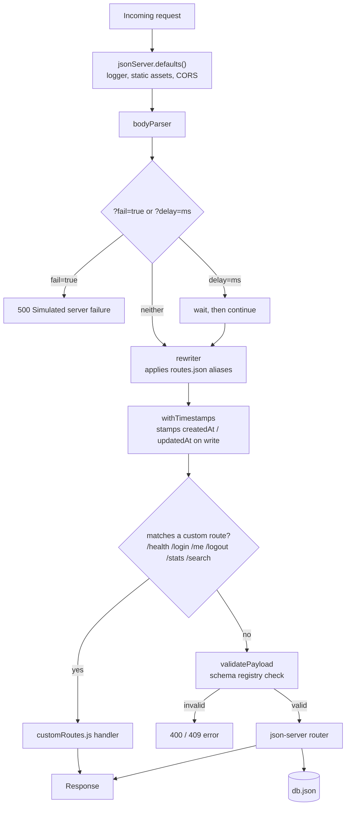
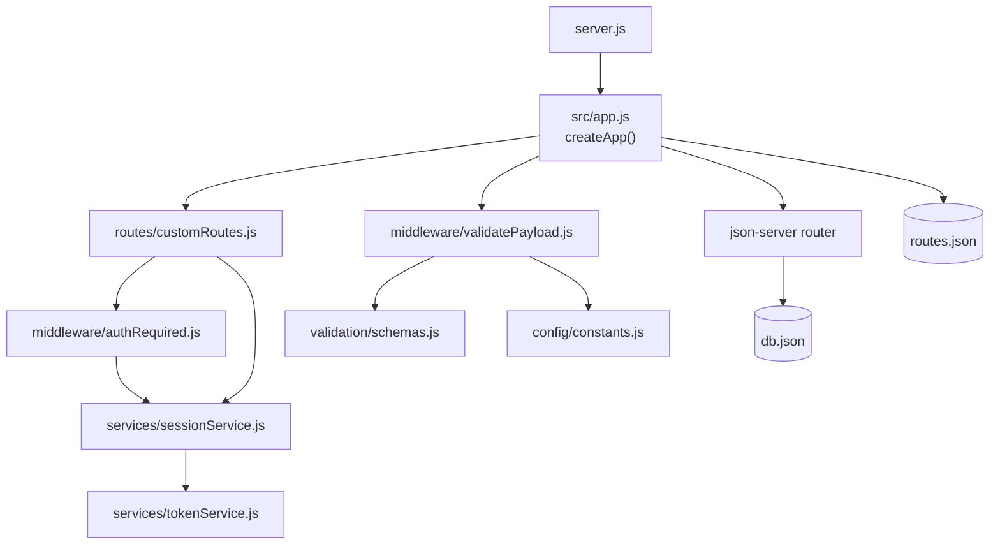
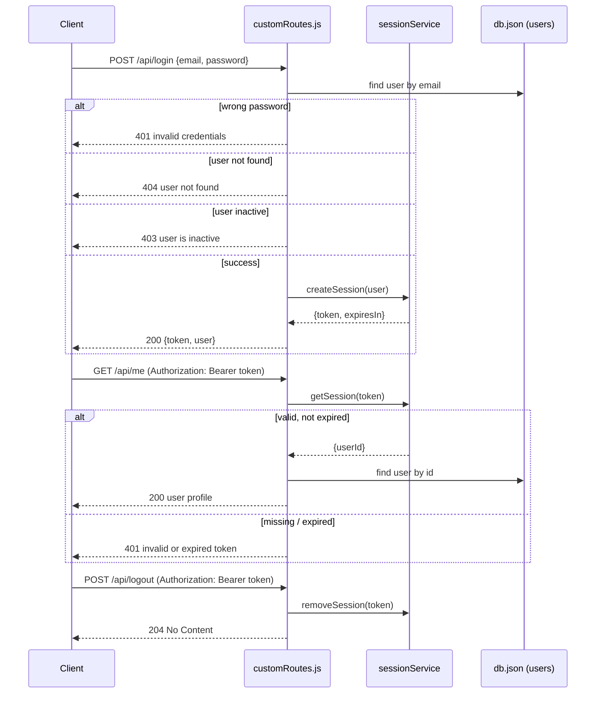
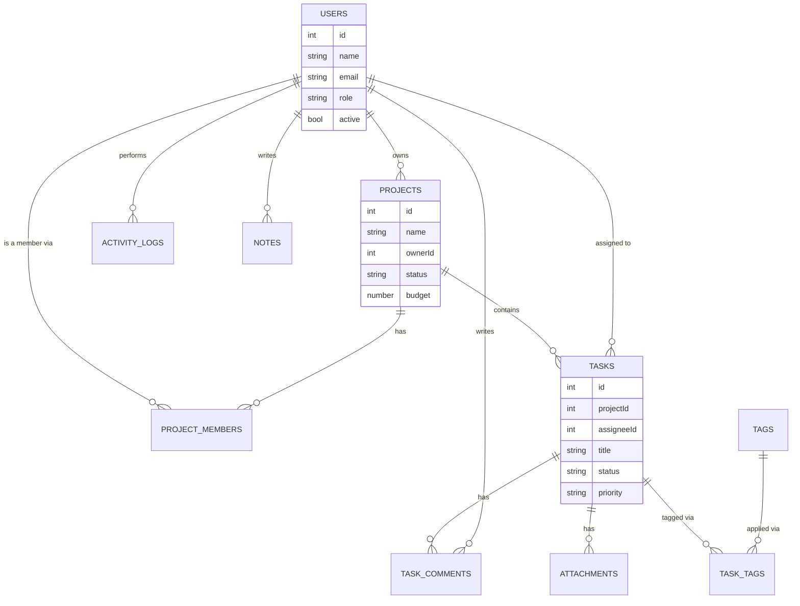

# json.server

A mock REST API built on top of [`json-server`](https://github.com/typicode/json-server), for
frontend developers who need a realistic backend to develop and test against without waiting on
a real one.

It serves the collections in `db.json` as full CRUD REST endpoints, adds a thin layer of custom
behavior on top (mock login/session, search, stats, request validation, response delay/failure
simulation), and stays intentionally small — no database, no build step, no framework lock-in.

## Contents

- [What This Project Gives You](#what-this-project-gives-you)
- [Quick Start](#quick-start-2-minutes)
- [How It Works](#how-it-works)
- [Auth Flow](#auth-flow)
- [Data Model](#data-model)
- [Validation](#validation)
- [Endpoints](#most-useful-endpoints)
- [Simulating Real-World UI States](#simulate-real-world-ui-states)
- [Testing](#testing)
- [Environment Variables](#environment-variables)
- [Postman Collection](#postman-collection-recommended)
- [Project Structure](#project-structure)
- [Keep It Simple](#keep-it-simple)

## What This Project Gives You

- Ready-to-use REST endpoints from `db.json`
- API prefix support (`/api/...`)
- Mock login/session endpoints (`/api/login`, `/api/me`, `/api/logout`)
- Search and stats endpoints
- Schema-based request validation for `users`, `projects`, and `tasks`
- Optional response delay and forced error simulation
- A Jest + Supertest suite that exercises the whole app without touching `db.json`

## Quick Start (2 minutes)

1. Install packages

```bash
npm install
```

1. (Optional) copy `.env.example` to `.env` to override `PORT` or `MOCK_LOGIN_PASSWORD`

1. Run server

```bash
npm run dev
```

1. Open API

- Base URL: `http://localhost:3100`
- API URL: `http://localhost:3100/api`
- Health: `http://localhost:3100/health`

## How It Works

`server.js` starts an HTTP server built by `createApp()` in `src/app.js`. Every request passes
through a fixed middleware pipeline before it ever reaches the `json-server` router that reads
and writes `db.json`.



Module map — what depends on what:



## Auth Flow

Auth is intentionally mock: one shared password (`MOCK_LOGIN_PASSWORD`), tokens are random
base64url strings, and sessions live in an in-memory `Map` (`sessionService.js`) — they reset
whenever the server restarts. That's a feature here, not a bug: it keeps the tool disposable.



## Data Model

`db.json` seeds a small project-management dataset. The relationships below drive the validation
rules in [Validation](#validation) (e.g. a task's `projectId` must reference a real project).



## Validation

Requests to `users`, `projects`, and `tasks` are checked against a declarative registry in
[`src/validation/schemas.js`](src/validation/schemas.js), enforced by
[`src/middleware/validatePayload.js`](src/middleware/validatePayload.js). Adding a rule to a
collection means adding a config entry, not another `if` branch:

```js
projects: {
  requiredOnCreate: { fields: ["name", "ownerId", "status", "budget"], message: "..." },
  enums: { status: { values: PROJECT_STATUS, message: "..." } },
  refs: { ownerId: { collection: "users", message: "..." } },
  numbers: { budget: { min: 0, message: "..." } },
}
```

Supported rule kinds: `requiredOnCreate` (POST only), `enums`, `normalize` (e.g. lowercasing
email), `unique` (per-collection uniqueness, excluding the record being updated), `refs`
(foreign-key existence checks against another collection), and `numbers` (type + min bounds).

## Most Useful Endpoints

### Auth

- `POST /api/login`
- `GET /api/me` (requires bearer token)
- `POST /api/logout` (requires bearer token)

Login body:

```json
{
  "email": "ava@example.com",
  "password": "demo123"
}
```

Header for protected routes:

```http
Authorization: Bearer <token>
```

### Data

- `GET /api/users`
- `GET /api/projects`
- `GET /api/tasks`
- `GET /api/projectMembers`
- `GET /api/taskComments`
- `GET /api/attachments`
- `GET /api/activityLogs`

### Utility

- `GET /api/stats`
- `GET /api/search?q=design`

## Friendly Route Shortcuts

Defined in `routes.json`:

- `GET /api/users/:id/tasks`
- `GET /api/projects/:id/tasks`
- `GET /api/projects/:id/members`
- `GET /api/dashboard` -> `GET /api/stats`

## Simulate Real-World UI States

Use these query params on GET requests:

- `?delay=800` (delay in ms, max 10000)
- `?fail=true` (returns 500)

Examples:

- `/api/tasks?delay=1200`
- `/api/projects?fail=true`

## Testing

```bash
npm test
```

Runs the Jest + Supertest suite in `test/`:

- `health.test.js` — health check
- `auth.test.js` — login/me/logout, including failure paths (wrong password, unknown email,
  inactive user, missing/expired token)
- `validation.test.js` — required fields, enum checks, foreign-key checks, and uniqueness for
  `users`, `projects`, `tasks`
- `utility.test.js` — `/stats`, `/search`, and the delay/fail simulation

Tests build the app via `test/helpers/buildTestApp.js`, which injects a small in-memory fixture
(`test/fixtures/db.js`) instead of the real `db.json` — so running the suite never reads or
writes your actual mock data.

## Environment Variables

Copy `.env.example` to `.env` to override these (all optional):

| Variable              | Default   | Purpose                                                    |
| --------------------- | --------- | ---------------------------------------------------------- |
| `PORT`                | `3000`    | Port the server listens on (npm run dev overrides to 3100) |
| `MOCK_LOGIN_PASSWORD` | `demo123` | Shared password accepted by POST /login                    |

## Postman Collection (Recommended)

Use `repro.json.server.postman_collection.json` for one-click testing.

1. Open Postman -> Import -> select `repro.json.server.postman_collection.json`
2. Set collection variable `baseUrl` to `http://localhost:3100`
3. Run `Login` request first
4. Copy `token` from login response
5. Set collection variable `token` and run `Me` / `Logout`

Included requests:

- Health
- Login
- Me
- Logout
- Stats
- Search
- User Tasks
- Project Members
- Tasks (Delayed)
- Projects (Fail)

## Project Structure

```text
server.js
routes.json
db.json
.env.example
repro.json.server.postman_collection.json
src/
  app.js
  config/constants.js
  middleware/
    authRequired.js
    validatePayload.js
    withDelayAndFailure.js
    withTimestamps.js
  routes/customRoutes.js
  services/
    sessionService.js
    tokenService.js
  utils/
  validation/schemas.js
test/
  health.test.js
  auth.test.js
  validation.test.js
  utility.test.js
  fixtures/db.js
  helpers/buildTestApp.js
```

## Keep It Simple

- Edit `db.json` to change data model
- Keep custom logic inside `src/routes/customRoutes.js`
- Keep validation rules inside `src/validation/schemas.js`

If you only need plain JSON Server behavior, you can disable custom features by removing
custom route/middleware registration in `src/app.js`.

## Port Notes

- npm run dev uses port 3100 by default (avoids common clashes on 3000)
- npm run dev:3000 forces port 3000
